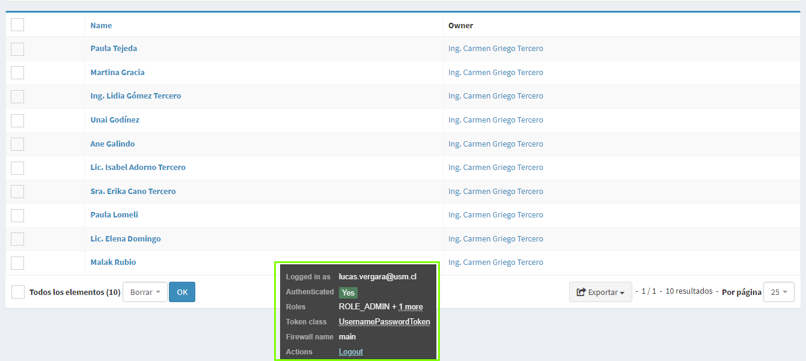
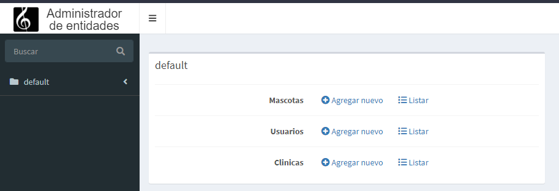
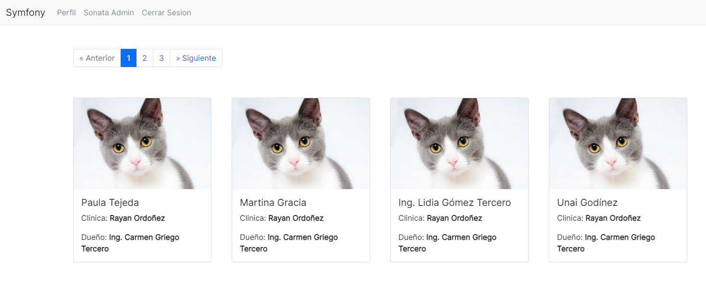
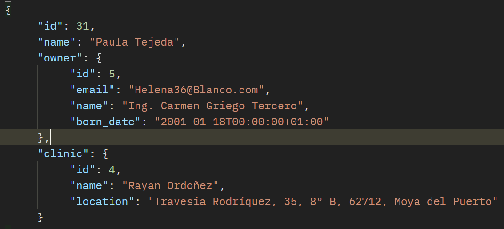

# Symfony Kuantum

Proyecto donde implemento todas las funcionalidades aprendidas en Symfony 5, entre ellas:
- Autenticación y Autorización a través de cookies y JWT
- CRUD de entidades
- Relación de modelos utilizando el orm doctrine
- Manejo de vistas a través de Twig
- Formularios y validaciones

## Tecnologías utilizadas

- Symfony 5
- Bootstrap 4
- MySQL
- Docker

## Capturas






## Uso

Verificar tener las dependencias necesarias para symfony y modificar la variable DATABASE_URL del archivo .env.

```bash
git clone https://kuantum@dev.azure.com/kuantum/Pr%C3%A1ctica/_git/LucasVergara `project_name`
cd `project_name`
composer install
php bin/console make:migration
php bin/console doctrine:migrate
php bin/console d:f:l # Seedear la base de datos con información de prueba
symfony server:start
```

## Licencia

[MIT](https://choosealicense.com/licenses/mit/)